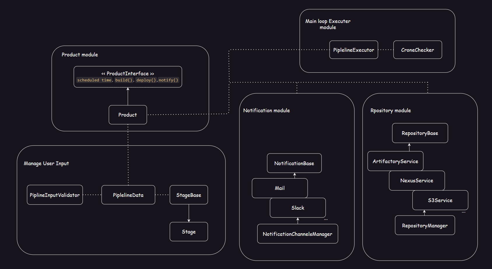

# Exercise: Product Delivery Pipeline

Design an object-oriented solution and write a (Python) program that manages product pipelines for the company.

### Problem Description:
We are building a product deployment pipeline to automatically deliver our products to various repositories.  
The pipeline needs to be easily extensible to new **repository targets**, new ***notification*** channels, and future **actions**.

### Requirements:
1. Each product **must** have the following attributes and actions: `scheduled time`, `build()`, `deploy()`, and `notify()`.
2. Deployment may be to **one or more** of the following targets: `Artifactory`, `Nexus`, `S3`.
3. Notification can be sent to **one or more** channels and user groups (e.g., Mail, Slack, etc.).
4. The main program should run a product pipeline with the following stages: build, deploy, and notify at the scheduled time each day.`*`

### Assignment:
1. Design the solution.
2. Define the input for the program.
3. Write a program that runs the product deployment pipelines based on the input.

`*` Build, Deploy, and Notify do not need to be fully implemented; printing the time, product, and action to stdout/log files will suffice.

---

Solution Design:


As part of ensuring the codebase is **extensible**, I enabled a mechanism to easily allow changing the implementation for existing repositories and adding new ones without changing the main method signature when calling for uploading artifacts through `publish_artifact()`. The same principle applies to the notification channels. More details and comments/documentation can be found in the dedicated modules: repository and notification.

**Modules** :
```bash
├── notification
├── pipeline_engine
├── product
├── repository
├── tests
└── user_input
```


**Dirs Structure** :
```bash
.
├── README.md
├── diagrams
├── main.py
├── notification
├── pipeline_engine
├── product
├── repository
├── requirements.txt
├── tests
├── user_input
├── user_input_piplines
└── venv
```


**User Input**
User user shout create a yaml file representing pipline for a give product. There are example undet the dir `user_input_piplines` and the schema can be found at `user_input/schema.json`.

```bash
 ll user_input_piplines/ | grep .yaml
-rw-r--r--  1 nadav nadav  707 Oct 15 02:10 core.yaml
-rw-r--r--  1 nadav nadav  599 Oct 15 02:10 platform.yaml
```


## Running the `product pipelines` system

Considering the user defines the two pipelines as below. :
Pipline A
```yaml
productName: "Mobileye-Platform"
scheduledTime: "52 3 * * *"
stages:

  - name: "Product Build" 
    type: build
    args:
      prefix: "platform"
      
  - name: "Repository Artifact Deploy" 
    type: deploy
    args:
      repositoryTargets:
        - type: "s3"
          url: "https://s3.amazonaws.com/my-app-bucket/releases/" 

  - name: "Notfication"
    type: notify
    args:
      channels:
        - type: mail
          endpoint: "integrationcore@mobileye.com"
          level: 5
        - type: slack
          endpoint: "https://hooks.slack.com/services/T00000000/"
          level: 3
```

Pipline B
```yaml
productName: "Mobileye-Core"
scheduledTime: "53 3 * * *"
stages:

  - name: "Product Build" 
    type: build
    args:
      prefix: "platform"
      
  - name: "Repository Artifact Deploy" 
    type: deploy
    args:
      repositoryTargets:
        - type: "artifactory"
          url: "https://artifactory.example.com/repository/my-app-releases" 
        - type: nexus
          url: "https://nexus.example.com/repository/my-app-releases" 

  - name: "Notfication"
    type: notify
    args:
      channels:
        - type: mail
          endpoint: "integrationcore@mobileye.com"
          level: 3
        - type: slack
          endpoint: "https://hooks.slack.com/services/T00000000/"
          level: 1
```


To allow better stdout debugging inside the main loop responsible for running all the pipelines until each one reaches a successful state, I set up a one-second delay and output the current time. We can see from stdout that the two pipeline configurations were loaded, validated, and executed at the scheduled cron time.

**stdout**

```shell
❯ /home/nadav/dev/Mobileye-Product-Delivery-Pipeline/venv/bin/python /home/nadav/dev/Mobileye-Product-Delivery-Pipeline/main.py
YAML core.yaml data is valid according to the schema.
YAML platform.yaml data is valid according to the schema.
03:51:21
03:51:22
03:51:23
03:51:24

...

03:51:56
03:51:57
03:51:58
03:51:59
03:52:00

Preper for stage type: build execution.
Resolve function  : build


<<< Pipline execution is about to start at the scheduled time : 52 3 * * * >>> 


Build Successful. Artifact : fplatform-c4912753-87a0-4e5b-86ad-8a078da8152e.zip 

Preper for stage type: deploy execution.
Resolve function  : deploy
Artifact: ~/.platform-c4912753-87a0-4e5b-86ad-8a078da8152e.zip successfully published to S3: https://s3.amazonaws.com/my-app-bucket/releases/

Preper for stage type: notify execution.
Resolve function  : notify
Notification: A mail notification has been createdת with level: '5' and endpoint: integrationcore@mobileye.com.
Notification: A Slack notification has been createdת with level: '3' and endpoint: https://hooks.slack.com/services/T00000000/.
03:52:01
03:52:02
03:52:03
03:52:04
03:52:05
03:52:06

...

03:52:53
03:52:54
03:52:55
03:52:56
03:52:57
03:52:58
03:52:59
03:53:00

Preper for stage type: build execution.
Resolve function  : build


<<< Pipline execution is about to start at the scheduled time : 53 3 * * * >>> 


Build Successful. Artifact : fplatform-f5d4a4f8-7b2e-491c-9d89-fe8c0d7e6570.zip 

Preper for stage type: deploy execution.
Resolve function  : deploy
Artifact: ~/.platform-f5d4a4f8-7b2e-491c-9d89-fe8c0d7e6570.zip successfully published to Artifactory: https://artifactory.example.com/repository/my-app-releases
Artifact: ~/.platform-f5d4a4f8-7b2e-491c-9d89-fe8c0d7e6570.zip successfully published to Nexus: https://nexus.example.com/repository/my-app-releases

Preper for stage type: notify execution.
Resolve function  : notify
Notification: A mail notification has been createdת with level: '3' and endpoint: integrationcore@mobileye.com.
Notification: A Slack notification has been createdת with level: '1' and endpoint: https://hooks.slack.com/services/T00000000/.
03:53:01
```